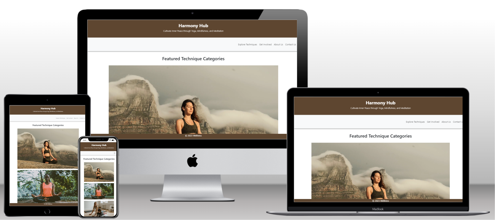
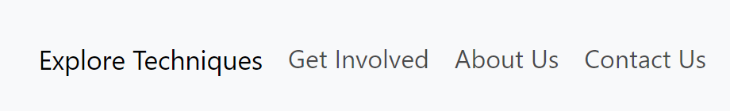

# Project 1 Meditation, Mindfulness & Yoga website

This website was created as a website for a fictional Mindfulness studio with classes available both online and offline. It's main target audience is for women aged between 18-45 who are new or beginning their journey into self-improvement, but the website is available for anyone to use. The website was made to help introduce people to the benefits of taking care of yourself, whether that's through mindfulness, meditation or yoga, for those who want to stay more active.

## Table of Contents
- [User Experience](#user-experience)
    - [User Stories](#user-stories)
    - [Design](#design)
- [Features](#features)
    - [Navigation Bar](#navigation-bar)
    - [Landing Page](#landing-page)
    - [Footer](#footer)
    - [About Us](#about-us)
    - [Explore Categories](#categories)
    - [Meditation/Mindfulness/Yoga](#meditationmindfulnessyoga)
    - [Get Involved](#get-involved)
    - [Contact](#contact)
- [Responsiveness](#responsiveness)
- [Features to Implement](#features-to-implement)
- [Technologies Used](#technologies-used)
- [Testing](#testing)
- [Validator](#validator)
- [Lighthouse](#lighthouse)
- [Accessibility](#accessibility)
- [Bugs/Issues](#bugs-issues)
  - [Fixed](#fixed)
  - [Unfixed](#unfixed)
- [Deployment](#deployment)
- [Credits](#credits)
    - [Media](#media)
    - [Content](#content)
    - [Code](#code)

## User Experience

### User Stories
- For users who were new to this site, I wanted it to be intuitive and easy to navigate, with a clearly labelled navbar as to not overwhelm new users.
- I also wanted the site to be not too simplistic, and to show any major updates to returning users, such as new featured techniques or new classes.

### Design

- The wireframes were developed using Balsamiq, this tool made it easy to visualise how I wanted the website to look before I began coding. I focused mainly on what it would look like in app form as I was building a mobile-first website.
- The palette was chosen based on earthy colours as this reflects the natural themes that surround the modern wellness movement.

## Features

### Navigation Bar
- To keep the nav bar neat, I kept the options to a minimum as to not overwhelm the user. It was built using bootstrap. The options give the user all the needed information whilst keeping the navbar short.
- I chose not to have the three techniques to be displayed in the menu, instead opting for them to be contained under the 'Explore Techniques' section to not clutter the menu and confuse the user.

- To add an element of interactivity, the option the user hovers over gets darker and larger.

### Landing Page
- The landing page gives the user the new / featured techniques of the week, and this would change every week, to keep returning visitors entertained and updated on new happenings.
- It encapsulates the theme of the website in one page: straight to the point learning about mindfulness, yoga and meditation.

### Footer
- The footer containts the name of the company and the copyright.
- I chose not to put any more information in the footer as I wanted it to be a sticky footer and I did not want it taking up too much space, all needed information can be found in the navbar.

### About Us
- The about us page gives the user all of the required information about the website and what it is used for.
- It gives the reasons this website is better than others and why the user should continue browsing this site.

### Explore Categories
- This page 

### Meditation/Mindfulness/Yoga

### Get Involved

### Contact

## Responsiveness

## Features to Implement

## Technologies Used

## Testing

## Validator

## Lighthouse

## Accessibility

## Bugs/Issues

### Fixed

### Unfixed

## Deployment

## Credits

### Media

### Content

### Code
- I used this as the navbar template: https://getbootstrap.com/docs/4.0/components/navbar/