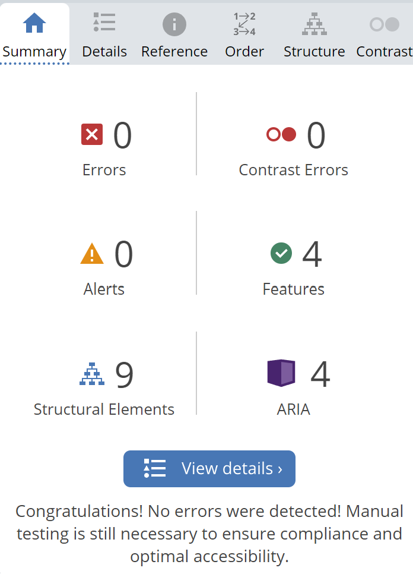

# Project 1 Meditation, Mindfulness & Yoga website

This website was created as a website for a fictional Mindfulness studio with classes available both online and offline. It's main target audience is for women aged between 18-45 who are new or beginning their journey into self-improvement, but the website is available for anyone to use. The website was made to help introduce people to the benefits of taking care of yourself, whether that's through mindfulness, meditation or yoga, for those who want to stay more active.
[Here is a link to the live website](https://kittydig.github.io/portfolio_1/index.html)

## Table of Contents
- [User Experience](#user-experience)
    - [User Stories](#user-stories)
    - [Persona](#persona)
    - [Design](#design)
- [Features](#features)
    - [Navigation Bar](#navigation-bar)
    - [Landing Page](#landing-page)
    - [Footer](#footer)
    - [About Us](#about-us)
    - [Explore Categories](#categories)
    - [Meditation/Mindfulness/Yoga](#meditationmindfulnessyoga)
    - [Get Involved](#get-involved)
    - [Contact](#contact)
- [Responsiveness](#responsiveness)
- [Features to Implement](#features-to-implement)
- [Technologies Used](#technologies-used)
- [Testing](#testing)
- [Validator](#validator)
- [Lighthouse](#lighthouse)
- [Accessibility](#accessibility)
- [Bugs/Issues](#bugs-issues)
  - [Fixed](#fixed)
- [Deployment](#deployment)
- [Credits](#credits)
    - [Media](#media)
    - [Content](#content)
    - [Code](#code)
- [Acknowledgements](#acknowledgements)

## User Experience

### User Stories
- For users who were new to this site, I wanted it to be intuitive and easy to navigate, with a clearly labeled navbar to not overwhelm new users.
- I also wanted the site to be not too simplistic, and to show any major updates to returning users, such as new featured techniques or new classes.

## Persona
- The persona I had in mind as the ideal user of this site was a 26-year-old woman who had heard of these practices but had not used any of them before.
- Her problem statement was 'I want to get more involved with mindfulness, yoga, and meditation, but I don't know where to start.'
- This website gives her all of the tools needed to get involved, whether this is online on her own, or in a group setting, she can work at her own pace.

### Design

- The wireframes were developed using Balsamiq, this tool made it easy to visualise how I wanted the website to look before I began coding. I focused mainly on what it would look like in app form as I was building a mobile-first website.
- The palette was chosen based on earthy colours as this reflects the natural themes that surround the modern wellness movement.

## Features

### Navigation Bar
- To keep the nav bar neat, I kept the options to a minimum as to not overwhelm the user. It was built using bootstrap. The options give the user all the needed information whilst keeping the navbar short.
- I chose not to have the three techniques to be displayed in the menu, instead opting for them to be contained under the 'Explore Techniques' section to not clutter the menu and confuse the user.

- To add an element of interactivity, the option the user hovers over gets darker and larger.

### Landing Page
- The landing page gives the user the new / featured techniques of the week, and this would change every week, to keep returning visitors entertained and updated on new happenings.
- It encapsulates the theme of having a straight-to-the-point page: straight to the point learning about mindfulness, yoga, and meditation.
-It incorporates using hovering over the image to reveal the name of the technique to reflect discovery as the user embarks on a self-discovery journey.

### Footer
- The footer contains the name of the company and the copyright.
- I chose not to put any more information in the footer as I wanted it to be a sticky footer and I did not want it taking up too much space, all needed information can be found in the navbar.

### About Us
- The About Us page gives the user all of the required information about the website and what it is used for.
- It gives the reasons this website is better than others and why the user should continue browsing this site.

### Explore Categories
- This page gives a list of all of the techniques on this website, it creates a space to find all of the techniques that are updated or added to each week.

### Meditation/Mindfulness/Yoga
- These pages follow the same format, with a title, image and description.
- These pages inform the user about different classes they can take and how this can benefit them.

### Get Involved
- Get involved is similar to the other pages, but it changes to three random classes that are offered on the website, this updates each week to keep returning users interested in the new classes highlighted each week.

### Contact
- The contact us page contains a form which must be fully filled out before it can be submitted, including a correct email address.
- This is used to contact the owner of the site with any issues or questions they may have.

## Responsiveness
- This website was built as mobile-first, so it is very responsive for all pages down to 260px across.
- The use of media queries made this easier to keep responsiveness across different device types. 

## Features to Implement
- I would like to implement a live map function to allow the user to see what is going on in their area.
- I would also like to add a page with the details of instructors for the user to be able to browse and find instructors that they can work with.

## Technologies Used
- I used Balsamiq for the wireframes.
- HTML, CSS and a tiny bit of JS for the sticky navbar.
- [Favicon](https://favicon.io/) for the favicon.
- [Gitpod](https://gitpod.io/workspaces) for writing the code, although I did begin by using [codeanywhere](app.codeanywhere.com) but this site was unreliable in terms of having the project accessible online.
- [Github](https://github.com/) for the repository.
- [Github Pages](https://pages.github.com/) to host the website.
- [Resizer](https://www.simpleimageresizer.com/) to resize the images.
- [Google fonts](https://fonts.google.com/) to import the fonts.

## Testing
- I tested this website on Edge and Chrome and it worked as expected.

## Validator
- This website passed both the HTML and CSS validator with no errors

## Lighthouse
- I tested the website through Lighthouse for both mobile and desktop, they both received good results

*Mobile*

*Desktop*
## Accessibility
- I tested my website through [WAVE](https://wave.webaim.org/) and it passed with no errors.

## Bugs/Issues

### Fixed
- When I first deployed the site, I noticed, there was a padding error at the bottom of the pages, which cut off the end of the body due to the footer overlapping. This was fixed by adding bottom padding to the content.
- I had some trouble with text becoming too narrow due to the large padding on either side for the about us page on mobile devices, but this was fixed by using a media query to change the padding size for smaller screens.

## Deployment
- The site was deployed using [Github Pages](https://pages.github.com/)
- Whenever I made a change to the code, I added the changes to the repository by using the commands:
    - 'git init' to initially create the directory where all the code will be pushed.
    - 'git add .' to stage all changes to the branch I was working on.
    - 'git commit -m "..."' to commit the changes and add a relevant comment.
    - 'git push' to push all of the new changes to the repository.
- The live website link is [here](https://kittydig.github.io/portfolio_1/index.html)
## Credits

### Media
- All media was taken from [Pexels](https://www.pexels.com/).

### Code
- I used this as the navbar template: https://getbootstrap.com/docs/4.0/components/navbar/
- I referenced Stack overflow for the sticky navbar JavaScript, specifically [this post](https://stackoverflow.com/questions/54681327/how-to-create-a-sticky-navbar-css-and-javascript).

## Acknowledgements
Thank you to my mentor Spencer Barriball for his support and guidance!